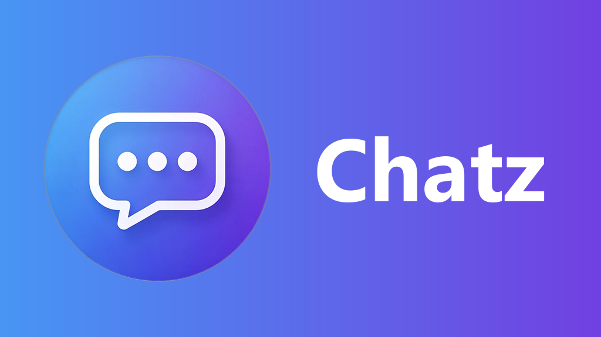

# Chatz Push (Jellyfin Plugin)

[中文](README.md) | **English**

<p align="center"></p>

Push Jellyfin events to **Chatz** or **Gotify**. Both can be enabled at the same time — the same notification goes to each.

> Requires **Jellyfin 12.x** (targets net10.0, built against Jellyfin.Controller 12.1.0)

## Features

- **Bilingual UI**: the config page follows your Jellyfin interface language (Chinese / English), falling back to Chinese when no English is available
- **8 notification types**: sign-in success / failure, playback start / stop, playback progress, media added / removed, subtitle download failure
- **Two push targets**: Chatz and Gotify have independent toggles and can run together
- **Webhook forwarding**: the plugin posts to Chatz via its webhook endpoint (`POST /hook/{appToken}`); with a Chatz server-side routing rule (the "Call Webhook" action) matching messages can be forwarded to any HTTP endpoint (ntfy, DingTalk, Feishu, your own service, … — the server has SSRF protection)
- **Per-notification settings**: enable switch, priority (0-10), cover image on/off
- **Custom templates**: both title and body are editable and support variables (see the table below); leave blank to use the defaults
- **Cover images**: the Jellyfin cover URL goes straight into `extras.image`, so both the app and the web UI render it
- **Markdown mode**: appends `` to the body so web clients that only read the body still show the image
- **Playback progress**: fires once at a configurable percentage (default 90%) with a cooldown; optionally skip the "playback stopped" notification for episodes that already sent progress
- **Library notification throttling**: new media is delivered one by one (keeps cover and path) queued at ~40/min, so it doesn't trip Chatz rate limiting
- **Chatz tags**: a global tag plus automatic semantic tags (e.g. "media added", "movie") for server-side routing rules (mute / split)

## Installation

### Option 1: drop the DLL in manually (simplest)

1. Download the latest zip from [Releases](https://github.com/yezi8430/jellyfin-plugin-chatz/releases)
2. Extract `Chatz.dll`
3. Put it in Jellyfin's plugin directory, e.g.:
   ```
   <Jellyfin config dir>/plugins/chatz/Chatz.dll
   ```
4. Restart Jellyfin

### Option 2: install from a plugin repository (gets update notifications)

1. Jellyfin Dashboard → **Plugins** → Repositories → Add
2. Enter this repository's manifest URL:
   ```
   https://raw.githubusercontent.com/yezi8430/jellyfin-plugin-chatz/main/manifest.json
   ```
3. Find **Chatz 推送** in the Catalog and install it. Future versions show up as updates.

## Configuration

Dashboard → Plugins → **Chatz 推送**.

### Push targets

| Field | Notes |
|---|---|
| Gotify server URL | e.g. `https://mess.example.com`, **no path** |
| Gotify app token | The token you get after creating an app in Gotify |
| Chatz server URL | e.g. `http://192.168.1.10:20010` — **host and port only, no `/hook`** |
| Chatz app token | The app token from Chatz WebUI — **not the global AUTH_TOKEN** |
| Chatz channel ID | Optional; blank or 0 = the app's own default channel |
| Chatz tags | Optional, comma separated, matched by server-side routing rules |
| External Jellyfin URL | Used to build cover image URLs, e.g. `https://jellyfin.example.com` |

> Chatz folds messages from the same app, channel and title within 5 minutes into one.
> To keep every notification separate, include a variable (e.g. `{itemName}`) in the title template.

### Template variables

Usable in both title and body (the config page shows the same list under "Variable Reference"):

| Variable | Meaning | Notes |
|---|---|---|
| `{itemName}` | Item name | Episode title for series; movie title for films |
| `{seriesName}` | Series | Equals the item name for non-series items |
| `{mediaName}` | Media name | Same as series in playback notifications; the entry name in library notifications |
| `{seasonNumber}` | Season number | Plain number, 0 for non-series |
| `{episodeNumber}` | Episode number | Plain number, 0 for non-series |
| `{seasonEpisode}` | Season/episode | Like `S01E02`; empty for non-series |
| `{itemType}` | Item type (EN) | English class name: `Episode` / `Movie` / `Series` |
| `{mediaType}` | Media type (CN) | Chinese: 电影 / 剧集 / 季 / 单集 |
| `{username}` | Username | Comma-joined when several users play at once |
| `{device}` | Device name | e.g. "Living room TV" |
| `{client}` | Client | e.g. Jellyfin Web / Infuse (**playback start only**) |
| `{progressPercent}` | Progress % | A number like 90 (**playback progress only**) |
| `{completed}` | Finished | Yes / No (**playback stop only**) |
| `{path}` | File path | Full path on the server (library notifications) |
| `{provider}` | Subtitle source | e.g. OpenSubtitles (**subtitle failure only**) |
| `{reason}` | Failure reason | Truncated past 300 characters (**subtitle failure only**) |

> Variables are only substituted in the notification types they belong to; elsewhere they stay as literal text.

## Building from source

### Locally (Docker, no .NET needed)

```bash
JELLYFIN_PLUGIN_DIR=/your/plugin/dir bash build.sh
```

- The deploy directory comes from `JELLYFIN_PLUGIN_DIR` (the default in the script is only a placeholder)
- Add `SKIP_RESTART=1` if you don't want it to restart Jellyfin automatically
- The first run pulls the .NET SDK image; later runs reuse it

### Locally (dotnet)

```bash
dotnet build -c Release
# Output: bin/Release/net10.0/Chatz.dll
```

### Releasing

Pushing a tag makes GitHub Actions build, zip and publish a Release:

```bash
git tag v1.0.0
git push origin v1.0.0
```

Once the Release exists, **write the version into `manifest.json` locally and push it** (the CI does not do this for you):

```bash
python tools/bump-manifest.py v1.0.0
git add manifest.json
git commit -m "chore: 更新 manifest.json (1.0.0.0)"
git push
```

> The `checksum` in `manifest.json` is the **MD5 of the packaged zip**, so it can only be computed after the zip exists — hand-writing it will never match (Jellyfin verifies on download).
> `bump-manifest.py` downloads the Release zip, computes the MD5, checks the archive really contains just `Chatz.dll` at the root, then writes the manifest.
>
> The full step-by-step checklist lives in **[RELEASE.md](RELEASE.md)** (maintainer notes, in Chinese).

## Layout

```
.
├── Consumers.cs                     # Event consumers: auth/playback/progress/library/subtitle failure
├── Plugin.cs                        # Plugin entry point, registers the config page
├── PluginConfiguration.cs           # Configuration model
├── PluginServiceRegistrator.cs      # DI registration
├── Configuration/configPage.html    # Dashboard config page (single file: HTML + CSS + JS)
├── images/logo.png                  # Plugin cover (Jellyfin catalog card + top of this page)
├── manifest.json                    # Repository manifest (updated by bump-manifest.py after release)
├── tools/bump-manifest.py           # Writes the local manifest entry after a release
├── RELEASE.md                       # Release / update procedure and known pitfalls
└── .github/workflows/release.yml    # Auto-publish on tag
```

## License

**GPL-2.0-or-later** (see [LICENSE](LICENSE)).

The plugin references Jellyfin's GPL packages, so it must use the GPL —
unlike the server and client in this project, which are MIT. Keep that in mind when modifying or redistributing it.
